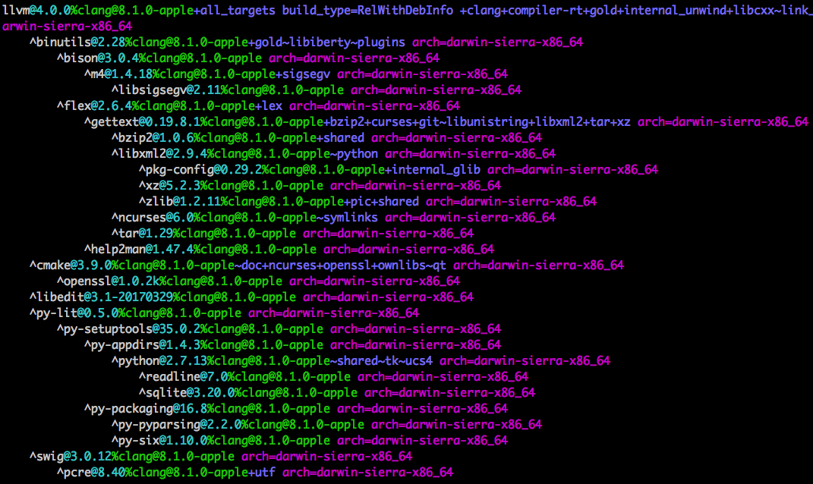
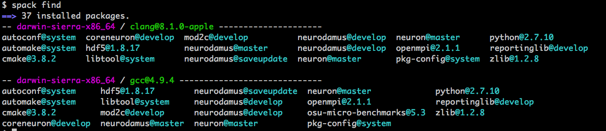

# THIS REPOSITORY IS DEPRECATED. IT MAY NOT BE USED NOR REFERENCED
# PLEASE USE [BlueBrain/spack](https://github.com/BlueBrain/spack) INSTEAD


[](https://travis-ci.org/pramodskumbhar/spack-packages)

# Repository Of Spack Packages And System Configurations

This repository contains Spack packages that are actively being developed for software components for neuroscience simulation and visualisation. Also, external package configurations (`packages.yaml`) are provided for different HPC systems in the world.

## Getting Started With Spack ##

If you are first time here and never used Spack then may be you are interested in:

* [Spack tutorial (SuperComputing 2016) ](http://spack.readthedocs.io/en/latest/tutorial.html)
* [Spack Documentation](http://spack.readthedocs.io/en/latest/#)
* [Google Group](https://groups.google.com/forum/#!forum/spack)
* And [Slack Channel](https://spackpm.slack.com/messages/C5W7NKZJT/)

Otherwise,

This document describes basic steps required to start development environment with Spack. Even though Spack can build entire software stack from scratch, for the developers it is more convenient to bootstrap from the existing packages provided by system which could be your personal laptop or HPC cluster.

Following instructions are divided into  `Platform Independent` and `Platform Specific` section. The former section describe steps necessary to bootstrap  Spack on any platforms (laptop or supercomputer platform). The later provides information about how one can take benefit of pre-installed softwares/modules and benefit from optimized libraries with minimum build time.

## Platform Independent Settings ##

These steps are independent of platform i.e. if you want to start from scratch or bootstrap from existing packages.

#### Prefix ####
We will use following prefix throughout the scripts. Set those according to your convenience:

```bash
SOURCE_HOME_DIR=$HOME/workarena/software/sources
```


#### Clone Repository ####
Clone Spack repository from GitHub. We could use [official repository](https://github.com/LLNL/spack) from LLNL but few modifications have been added to our fork (for existing bugs on some systems like BBP IV BG-Q) and we test it via Jenkins plan. Hence we will use following fork:

```bash
cd $SOURCE_HOME_DIR
git clone https://github.com/pramodskumbhar/spack.git

cd spack

# if you want to track upstream development branch
git remote add llnl https://github.com/llnl/spack.git
git fetch llnl
```

#### Update .bashrc or .bash_profile ####
In order to access Spack shell support, add following in your `.bashrc` (linux) or `.bash_profile` (OS X):

```bash
export SPACK_ROOT=$HOME/workarena/software/sources/spack
source $SPACK_ROOT/share/spack/setup-env.sh
```

We assume that [Environment Modules](http://modules.sourceforge.net/) is properly installed and `module` command is available on the `PATH` environment variable. Check [Spack documentation](https://spack.readthedocs.io/en/latest/getting_started.html#installenvironmentmodules) if this is not the case.

Make sure to `source` your `.bashrc` or `.bash_profile` whenever you update it.

#### Additional Packages ####

We have new packages for some of the software components (from BBP) in a separate repository (e.g. NEURON, CoreNEURON, ReportingLib, Neurodamus, NEST). In order to build those packages with Spack, add bellow GitHub repository as a Spack package repository:

```bash
cd $SOURCE_HOME_DIR
git clone https://github.com/pramodskumbhar/spack-packages.git
spack repo add --scope site `pwd`/spack-packages
```
You can check the existing repositories using below command:

```
$ spack repo list
==> 2 package repositories.
bbp        /Users/kumbhar/workarena/software/sources/spack-packages
builtin    /Users/kumbhar/workarena/software/sources/spack/var/spack/repos/builtin
```

Note that the `builtin` repository contains all packages provided by Spack. The `bbp` repository is the one that we just added.

Make sure to update / pull both repositories if there are any upstream changes.

Once you followed above setup, you can execute `spack arch` command to find out which platform and architecture you are building for:

```
$ spack arch
darwin-sierra-x86_64
```

If you are on linux system:

```
$ spack arch
linux-rhel6-x86_64
```

> Note that `darwin` is the platform name and it could be `linux`, `bgq`, `cray` etc. depending on the system you have.


## Platform Specific Configuration ##

Once you setup Spack, you can start installing the entire software stack including compilers, libraries, MPI etc. But as an end user of computing systems, we typically have pre-installed software stack like compilers, MPI, scientific libraries, build tools etc. One of the most useful feature of Spack is the ability to integrate with existing softwares with ease. For example, if you start your development on desktop or Lugano vizcluster, do you want to install `GCC`, `LLVM` compilers, flex, bison, Python, CMake, autoconf etc. from source yourself? Or, do you want to use `apt`, `brew` or pre-installed softwares, modules?

If you haven't installed such softwares from source, here are examples of dependencies shown by

`$ spack spec hdf5`:


and `$ spack spec llvm`:



The hierarchical output shows that the `hdf5` package depends on `openmpi` (for parallel library) which depends on `hwloc` which depends on `libxml` and so on. The same story with LLVM but the dependency tree is large! Do we want to install all those packages from source? Even flex, bison and their ten different dependencies?

Some users might want to install everything from scratch (e.g. system engineers or developer needing latest `trunk` of LLVM!). But often we want to use existing softwares as much as possible and then concentrate on our own software stack and dependencies.

As a user of BBP-IV Lugano VizCluster, Lugano BG-Q, MIRA BG-Q, Theta (Cray KNL), JURON (Cray KNL), JULIA (IBM Power 8), Piz Daint (Cray x86_64 + GPU) systems, we have created configurations of existing softwares that can be used with Spack. The configurations are present in `sysconfigs` directory.

Typically we create platform specific configurations in `$HOME/.spack/arch` directory where `arch` could be `linux`, `bgq`, `cray` etc. For example, on Lugano BBP IV VizCluster we can use existing configurations as :

```
mkdir -p $HOME/.spack/linux/
cp -r $SOURCE_HOME_DIR/spack-packages/sysconfigs/bbpviz/* ~/.spack/linux/
```

> Note that the configurations in `bbplinuxdesktop`, `mac`, `docker` are from local development environment and you may have different software versions / stack.

Using such configurations we can use existing system installed packages or modules and build minimum necessary components. For example, with above configuration `spack spec -I hdf5` shows (`-I` for installation status):


Now MPI (`mvapich2`) is already installed (indicated by `[+]`)  and we will build only `zlib` and `hdf5`.


If there is a `config.yaml` (e.g. `$HOME/.spack/linux/config.yaml`) in the provided configurations, it might look like:

```
config:
  install_tree: ~/spack_install/viz/
  module_roots:
    tcl: ~/spack_modules/viz/tcl/
    lmod: ~/spack_modules/viz/lmod/
  build_stage:
    - $spack/var/spack/stage
```

This yaml file specifies the path where softwares will be installed and modules will be created. Update these paths as per your directory preferences. If you add / change `module_roots` then make sure to reload `setup-env.sh` so that Spack knows the new module path (otherwise you will get `Unable to locate a modulefile` error while loading packages with Spack):

```
source $SPACK_ROOT/share/spack/setup-env.sh
```

If you don't have `config.yaml` file then Spack will install softwares in `$SPACK_ROOT/opt/spack/linux-arch-xxx/gcc-xxx` (platform, architecture and compiler names will be different). More detailed information about Spack configuration files is [here](http://spack.readthedocs.io/en/latest/configuration.html).

The provided configurations in `sysconfigs` directory are for specific system that we are using. But how to create such configurations? What if we want to build software stack on completely new Power-X supercomputer?

In order to understand the complete workflow, we will go through step-by-step tutorial for OS X and Linux cluster platform. Once you are familiar with this workflow, you can use same workflow for any platform.

### Bootstrapping Spack on Mac OS X ###

As discussed earlier, we can build the entire software stack including `CMake`, `GCC`, `LLVM`, `MPI` (`MPICH` or `OpenMPI`) with Spack on our laptop. But for development purpose, most of the time, we don't want to build these packages from source as they take long time to build (my poor MacBook from 2011!). In this case it is a good idea to use `Homebrew` or `Macport` to install these packages.
>
 Note that you can skip installing packages from `Homebrew` if you want to install everything from source with Spack. But then you will end up building lots of dependencies.

So lets start installing common packages that we need:

```bash
brew install autoconf automake libtool pkg-config cmake flex bison
```

Apart from Apple Clang, we may want to use `GNU`:

```bash
brew install gcc49
```

If you want, for convenience, create symlinks for gcc, g++ and fortran (this is because default gcc and g++ are actually clang compilers on OSX).

```bash
cd /usr/local/bin/
ln -s ../Cellar/gcc\@4.9/4.9.4/bin/g++-4.9 g++
ln -s ../Cellar/gcc\@4.9/4.9.4/bin/gcc-4.9 gcc
ln -s ../Cellar/gcc\@4.9/4.9.4/bin/gfortran-4.9 fortran
```

For zlib

```bash
brew tap homebrew/dupes
brew install zlib
```

We commonly need MPI library, we can install it using `Homebrew`. The `openmpi` library installed using `Homebrew` can be used with other compilers (gcc/clang):

```
brew install openmpi
```

Spack uses `environment-module` i.e. `Modules` and `Lmod` packages to load / unload modules. You can install those using Spack or from `Homebrew`:

```bash
brew install modules
brew install homebrew/science/lmod
```

If you are using parallel HDF5, install it using:

```bash
 brew install hdf5 --with-mpi
```

Boost is often time consuming too build (depending on version and compiler):

```bash
brew install boost@1.55
```

> You can install latest version using `brew install boost` if you want.

Now we have all required packages installed from `Homebrew`. Update `.bashrc_profile` with path for `modules` package so that Spack can use it:

```bash
MODULES_HOME=`brew --prefix modules`
source ${MODULES_HOME}/Modules/init/bash
```

Or, if you want to use more advanced hierarchical module environment based on `Lmod` then:

```bash
LMOD_HOME=`brew --prefix lmod`
source $LMOD_HOME/lmod/init/bash
```

> On OSX typically path is `/usr/local/opt/modules/Modules/init/bash`

Building Qt by hand is quite complex. Let's use the one kindly provided by brew:

```bash
brew install qt55
```

Lets start with Spack now!

##### Compiler Configuration #####

First step with Spack is to find compilers available on system. We can do this with following command:

``` bash
spack compiler find
```

This will find common compilers available in `$PATH` and print out the list:

``` bash
==> Added 2 new compilers to /Users/kumbhar/.spack/darwin/compilers.yaml
    gcc@4.9.4  clang@8.1.0-apple
==> Compilers are defined in the following files:
    /Users/kumbhar/.spack/darwin/compilers.yaml
```

Note that new file `.spack/darwin/compilers.yaml` is created in `$HOME` which stores all compiler configuration. This file looks like:

``` bash
compilers:
- compiler:
    environment: {}
    extra_rpaths: []
    flags: {}
    modules: []
    operating_system: sierra
    paths:
      cc: !!python/unicode '/Applications/Xcode.app/Contents/Developer/Toolchains/XcodeDefault.xctoolchain/usr/bin/clang'
      cxx: !!python/unicode '/Applications/Xcode.app/Contents/Developer/Toolchains/XcodeDefault.xctoolchain/usr/bin/clang++'
      f77: /usr/local/bin/gfortran
      fc: /usr/local/bin/gfortran
    spec: clang@8.1.0-apple
    target: x86_64
- compiler:
    environment: {}
    extra_rpaths: []
    flags: {}
    modules: []
    operating_system: sierra
    paths:
      cc: /usr/local/bin/gcc-4.9
      cxx: /usr/local/bin/g++-4.9
      f77: /usr/local/bin/gfortran-4.9
      fc: /usr/local/bin/gfortran-4.9
    spec: gcc@4.9.4
    target: x86_64
```

Or, if your don't have Xcode installed or have different compiler versions then Clang compiler section might look different:

```
- compiler:
    environment: {}
    extra_rpaths: []
    flags: {}
    modules: []
    operating_system: sierra
    paths:
      cc: /Library/Developer/CommandLineTools/usr/bin/clang
      cxx: /Library/Developer/CommandLineTools/usr/bin/clang++
      f77: null
      fc: null
    spec: clang@8.1.0-apple
    target: x86_64
```

The `compilers.yaml` file has configuration for every compiler. You can check if the auto-detected compilers are correct. Note that fortran compilers are *not* provided by `Apple Clang` and hence building any package requiring fortran compiler will fail with `Clang` (for example, `hdf5` package). It's safe to use `gfortran` with `clang` compilers (until we get [`flang`](https://github.com/flang-compiler/flang) releases in near future).

You can list the compilers using `spack compilers`:

``` bash
spack compilers
==> Available compilers
-- clang sierra-x86_64 ------------------------------------------
clang@8.1.0-apple

-- gcc sierra-x86_64 --------------------------------------------
gcc@4.9.4
```

And if you install new compiler, then force to re-search it using:

```bash
spack compiler find

==> Found no new compilers
```

Often compilers are installed in non-standard directories which are not in $PATH. You can provide path search compilers as:

```bash
spack compiler find /usr/local/Cellar/llvm/3.9.0/

==> Added 1 new compiler to /Users/kumbhar/.spack/darwin/compilers.yaml
   clang@3.9.0
```


##### Package Configuration #####

Second important step is to tell spack about `existing` packages. Spack can build most of the environment for you but we want to use packages like `MPI`, `CMake`, `autotools` etc. provided by the system. This is more important on HPC facilities where packages like `MPI` are tuned for hardware and provided by supercomputing center/vendors. We don't want to install those ourselves from source. This is where `packages.yaml` file in `$HOME/.spack/darwin/` comes into action (`darwin` here is platform name). The `packages.yaml` tells spack which existing packages to use, their versions, compiler preferences etc. For example, if you try to build package which need `CMake`, Spack will try to build `CMake` and all its dependencies from source. But we have previously installed `CMake` with `brew` and we can tell spack to use it using below `packages.yaml`:

```yaml
packages:
    cmake:
        paths:
            cmake@3.8.2: /usr/local
        buildable: False
        version: [3.8.2]
```

In the above configuration we told Spack to use `CMake` from `/usr/local` (installed by `Homebrew`). Finally `buildable: False` tells Spack to not build this package from source. So Spack will never try to build this package explicitly and if constraints are not satisfied, the following error is raised:

```bash
==> Error: The spec 'cmake' is configured as not buildable, and no matching external installs were found
```

When we specify dependency like `depends_on('cmake', type='build')`, Spack will match any CMake version available. But many packages specify version constraints in the dependency like `depends_on('cmake@2.8.12:', type='build')`. This indicates that `CMake` version should be  `>=2.8.12`. To satisfy this constraint you have to make sure to provide appropriate version. Otherwise you can remove `buildable: False` option.

We can provide preferences for all packages in `packages.yaml`. For example, in the below configuration we specified compiler preferences for building any package. Also, we specify `mpich` as `MPI` provider.

```yaml
packages:
   all:
       compiler: [gcc@4.9.4, clang@8.1.0-apple]
       providers:
           mpi: [mpich]
```

Another important aspect is `variants`. The `packages.yaml` allows us to specify `variant` preferences. This is important aspect while building packages on different platforms or by different members of the team. For example, consider the example of `HDF5` package. If you look at `HDF5` package using `spack info`, it shows different variants including `fortran`:

```bash
spack info hdf5
Package:    hdf5
Homepage:   http://www.hdfgroup.org/HDF5/
....
Variants:
   Name          Default   Description

   cxx           on        Enable C++ support
   debug         off       Builds a debug version of the library
   fortran       on        Enable Fortran support
....
```

On OS X if you don't have fortran compilers with `llvm` toolchain, you can disable fortran variant in `packages.yaml` as:

```yaml
packages:
   hdf5:
       variants: ~fortran
```

With the above configuration we tell spack to not build fortran bindings of `HDF5` package. Now `HDF5` will be built by `Clang` compiler without any errors. Similarly we can specify version preferences. For example, latest `Boost` version takes long time to build. We need `Boost` for testing purpose and old version is sufficient:

```bash
   boost:
       version: [1.51.0]
```

With all system packages, `$HOME/.spack/darwin/packages.yaml` looks like below:

```yaml
packages:
    cmake:
        paths:
            cmake@3.9.1: /usr/local
        buildable: False
        version: [3.9.1]

    autoconf:
        paths:
            autoconf@system: /usr/local
        buildable: False
        version: [system]

    automake:
        paths:
            automake@system: /usr/local
        buildable: False
        version: [system]

    libtool:
        paths:
            libtool@system: /usr/local
        buildable: False
        version: [system]

    openssl:
        paths:
            openssl@system: /usr/local
        buildable: False
        version: [system]

    flex:
        paths:
            flex@system: /usr/local
        buildable: False
        version: [system]

    bison:
        paths:
            bison@system: /usr/local
        buildable: False
        version: [system]

    pkg-config:
        paths:
            pkg-config@system: /usr/local
        buildable: False
        version: [system]

    environment-modules:
        paths:
            environment-modules@system: /usr/local
        buildable: False
        version: [system]

    python:
        paths:
            python@2.7.10: /System/Library/Frameworks/Python.framework/Versions/2.7
        buildable: False
        version: [2.7.10]

    hdf5:
        paths:
            hdf5@1.10.1: /usr/local
        buildable: False
        variants: ~fortran
        version: [1.10.1]

    zlib:
        paths:
            zlib@1.2.11: /usr/local
        buildable: False
        version: [1.2.11]

    qt:
        paths:
            qt@5.5.1: /usr/local/Cellar/qt55/5.5.1
        buildable: False
        version: [5.5.1]

    openmpi:
        paths:
            openmpi@2.1.1: /usr/local
        buildable: False
        version: [2.1.1]

    boost:
        paths:
            boost@1.55.0%clang@8.1.0-apple: /usr/local
        version: [1.55.0]

    gcc:
        paths:
            gcc@4.9.4%gcc@4.4: /usr/local
        buildable: False
        version: [4.9.4]

    llvm:
        paths:
            llvm@8.1.0-apple%gcc@4.4: /usr/local
        buildable: False
        version: [8.1.0-apple]

    all:
        compiler: [gcc@4.9.4, clang@8.1.0-apple]
        providers:
            mpi: [openmpi]
```

With above configuration we tell Spack to find various packages under `/usr/local` installed by `Homebrew`, compiler preferences and `openmpi` as `MPI` library preference.

###### FAQs ABOUT `packages.yaml`  #####

* Why some packages are specified as `autoconf@system`?

	Older version of Spack allowed to specify version as `system`. This meant software specified is system installed and hence use it without checking version requirements (A way to say "don't worry, just use it!"). This practice is discouraged now and we should specify exact version number in `packages.yaml` to avoid incompatible version issues. When packages specify `explicit` version requirements then often you have to provide version specification instead of just `@system`.

* Why some packages are specified with compiler specification and without `buildable: False`?

	Consider boost specification:

	```
	    boost:
        paths:
            boost@1.55.0%clang@8.1.0-apple: /usr/local
        version: [1.55.0]
	```

	When we install boost using `brew`, the installed boost libraries can not be linked with gcc compiled application. In this case we want to use pre-installed boost if we are compiling application with clang. But if are building with gcc then we want Spack to allow to build Boost from source and hence we don't specify `buildable: False`.

* I am getting `Error: The spec 'xxx' is configured as not buildable, and no matching external installs were found`.  What should I do?

	Suppose we have specified `A@system` in `packages.yaml` as system installed package. If there is another package `B` explicitly asking for specific version say `A@2.2`, Spack can't build `B` because suitable version of `A` is not available and Spack can't build it from source. In this case we can change `system` to `actual version` of `A` or remove `buildable: False` to let Spack build from source.

* Why have we specified `gcc` / `llvm` compilers as built by gcc version 4.4?

	The answer will be more clear when we will go through `Generating Modules` section : when we generate modules using [LMOD](https://www.tacc.utexas.edu/research-development/tacc-projects/lmod) we have to specify one core compiler and then sub-compilers for building module hierarchy. As we have installed compilers from binary (`brew`), we specify that these compilers are built by some compiler `gcc v4.4`. And then in LMOD specification we can use  `gcc v4.9.4` and `clang v8.1.0` in module hierarchy.

* I have different versions of compilers, libraries, mpi and other packages. What should I do?

	You can use `packages.yaml` as template and add/delete new packages as per your requirements. You can update versions, compiler preferences etc.

* I created `packages.yaml` but getting "Error: Error parsing yaml in ...xxx...". Even worse just "Error". What to do?

	Spack configuration files are [YAML](http://www.yaml.org/start.html) specifications. If you have not used proper indentation or mixed spaces/tabs then we get parsing errors. Sometime we don't get clear message from Spack and difficult to trace the error. In this you can use `--debug` or `-d` option to spack command to provide detailed trace:

	```
	spack -d spec hdf5
	```

* Can I tell spack to build specific package with only one compiler in `packages.yaml`?

	It would be convenient to specify something like below in `packages.py`

	```
    boost:
        compiler: gcc@4.4
	```

	This is to force using specific compiler `gcc 4.4` whenever we build boost (to avoid multiple installations). But this feature is still not implemented. To achieve this today, we have to explicitly specify constraint on command line:

	```
	spack install packageA %clang ^boost %gcc@4.4
	```

* I am trying to build packageX but this is failing with my favorite compiler version XX and OS YY. Why?

	Spack packages are being developed by system engineers, package developers, domain scientists and others. Not every package is tested for every possible compiler version and OS distribution. Some packages can't be build on specific platform or specific compilers (e.g. Cray or Pathscale compiler?). Such packages are being improved so that the [conflicts](http://spack.readthedocs.io/en/latest/packaging_guide.html#conflicts) are being added. And hence sometime you have to check some more details about compatibility / build failure.

* I am getting `spack.config.ConfigFileError: Error parsing yaml ...`. What to do?

	Spack configurations are written in YAML format and above error indicates invalid YAML. Make sure to add valid YAML configurations (especially while copy/paste from tutorials). You can use `-d` debug options to get more information about the error.

---

##### Spack in Action: Installing Packages #####

In the previous section we saw how to setup external packages in `packages.yaml` and compilers in `compilers.yaml`. Now we are ready to install packages!

> Note that the screenshot in this section might be showing different package / compiler versions and their dependencies.

Before installing any package, first step is to check what is going to be installed! For this we use `spack spec -I` command. For example, below command shows how hdf5 package is going to be installed:


Here Spack is going to install 1.8.17 version of hdf5 using gcc 4.9.4. You can ignore rest of the information for now. Now if we try to install it using `spack install`:


Instead of installing hdf5 from source, Spack detects that the hdf5 is externally installed (as per our specification in `packages.yaml`) and just register into database. If you now look at the status of `hdf5` using `spec -I` command, we see `[+]` symbol indicating the installed status:

![spack spec install hdf5] (.images/spec_hdf5_after_status.png)

Note that if you don't have `packages.yaml` configuration file under `$HOME/.spack` or `$HOME/.spack/darwin`, `spack spec -I hdf5` will show below output:


i.e. Spack is going to install all dependencies including openmpi, hwloc etc. from source. Hence before installing `hdf5` you should ask yourself if you really want to build `openmpi` and all its dependencies. If `spack spec` is showing dependencies that you don't want to build then you have to check external package specification in `$HOME/.spack/darwin/packages.yaml`.

###### FAQ : Does `spack spec -I` showing all packages that are going to be install? ######

Consider `spack spec -I` output for OSU benchmark that we typically use for MPI communication / network benchmarking:


We have specified `openmpi` in `packages.yaml` but still it's status is not shown as `installed` using `[+]` symbol. As previously discussed, openmpi is still not registered into database. So how can we know if the package is going to be installed or not? If you look at the output of previous two screenshots you will see importance different where `openmpi` was showing all it's dependency tree including `hwloc->libxml2->pkg-config` etc. Lack of this dependency in last output gives an indication that the package is not going to be installed. If you try to install openmpi and then check spec you will see `openmpi` status as installed:


Better way to avoid this confusion is pre-registering all external packages into Spack database. For example, if we have added packages like `flex`, `bison`, `autoconf` etc. into the `packages.yaml` (with `buildable: False`) then we can invoke `install` command at the begining and Spack will register them into the database without installation:

```
$ spack install flex bison autoconf
==> flex@system : externally installed in /usr/local
==> flex@system : generating module file
==> flex@system : registering into DB
==> bison@system : externally installed in /usr/local
==> bison@system : generating module file
==> bison@system : registering into DB
==> autoconf@system : externally installed in /usr/local
==> autoconf@system : generating module file
==> autoconf@system : registering into DB
```

---

Once we are sure about the packages going to be installed, we can install package using `spack install` command as:


Now you can get list of all installed packages using `find` command:


You can load the installed package using `load` command as:

```
$ spack load osu-micro-benchmarks

$ module list
Currently Loaded Modulefiles:
  1) osu-micro-benchmarks-5.3-gcc-4.9.4-lx75aay
```

Similarly you can install other packages provided by Spack. You can see available packages using `list` command:

```bash
$ spack list
==> 1792 packages.
abinit    everytrace          jansson   mpc   py-certifi  py-radical-utils  r-modeltools  stc
abyss     everytrace-example  jasper    mpe2  py-cffi     py-ra
....

$ spack list mod2c

==> 1 packages.
mod2c
```

We have added `spack-packages` repository in the beginning. You can see which package repositories have been added using `repo list` command as:

```bash
$ spack repo list

2 package repositories.
spack-packages        /Users/kumbhar/workarena/software/sources/spack-packages
builtin    /Users/kumbhar/workarena/software/sources/spack/var/spack/repos/builtin
```

We can see the dependencies of `NEURON` package with `spack spec` command change compiler using `%` symbol followed by compiler name as:


We can install `NEURON` with 'clang' and 'gcc' compiler as as:

```
spack install neuron %gcc
spack install neuron %clang
```


If you have large number of packages with different dependencies and different build options (`variants` in Spack world), you can install those one by one or write a script (e.g. under Jenkins). Here is example of installing BBP simulation stack using `Clang` and `GNU` compiler:


```bash
#!/bin/bash

set -x

# list of packages to install
dev_packages=(
    coreneuron
    neurodamus@master
    neurodamus@saveupdate
    neurodamus@develop
    'neuron -python'
)

compilers=(
    '%gcc'
    '%clang'
)

uninstall_package() {
    for package in "${dev_packages[@]}"
    do
        spack uninstall -a -f -R -y $package
    done
}

# if any inconsistent packages
spack reindex

# uninstall all packages
uninstall_package

# stop if any package installation fails
set -e

# for every compiler
for compiler in "${compilers[@]}"
do
	 # build each package
    for package in "${dev_packages[@]}"
    do
        spack install $package $compiler
    done
done
```

The above script will build CoreNEURON, ReportingLib, Mod2c, NEURON, three different branches of Neurodamus (master, saveupdate for INCITE, develop for CoreNEURON development) and NEURON without python support using gcc as well as clang compilers (total 16 packages). You can see all installed packages using `find` command:



There are lot of useful commands and here are some useful once:

* `spack find %gcc` : find all packages compiled with gcc compiler
* `spack find neuron` : find all packages matching neuron as substring
* `spack find arch=darwin-sierra-x86_64` : find all packages compiled for specific architecture (useful in cross compiling environment)
* `spack find -p` : find packages and also show installation path
* `spack find -d neuron` : find neuron package and show how it was built with dependency tree:

* `spack uninstall --all -y` : uninstall all packages and yes for confirmation
* `spack uninstall %gcc` : uninstall gcc compiled packages
* `spack uninstall --all --dependents -y cmake` : uninstall CMake and all packages that dependent on CMake
* `spack uninstall --all ^python@2.7` : uninstall all packages dependent on Python 2.7
* `spack compilers` : show compiler list
* `spack compiler find` : find new compilers in $PATH
* `spack config get packages` : show configurations for packages (i.e. `packages.yaml`)
* `spack modules refresh --delete-tree` : delete existing modules and regenerate them all (see next section)
* `spack info hdf5` : show information of hdf5 package (available versions, variants, dependencies etc.)
* `spack checksum mpich` : check for versions of mpich package and calculate checksum for available tarballs

##### Generating Modules #####

In the previous section we saw how to install different softwares. Spack provides `load` command to easily load packages. For example, you can say:

```
$ spack load neuron +python %gcc ^python@2.7
```

This means "Hey, load neuron package compiled with python bindings enabled, using gcc compiler and python used should be be version 2.7". This command line syntax of Spack is very useful for loading complicated dependency tree. But in scientific computing environment we often need to provide interface for users that they are already familiar with. For example, typically users are familiar with Environment Modules, LMod or Dotkit. Good news is that the Spack has built in support for automatically generating such modules. Spack internally uses tcl modules or lmod itself. For example, if you do `module avail` you will see all modules generated:


Those are modules for all software that we have installed so far! If you look at module names carefully then you can see :

* modules are named as `package name` + `version` + `compiler` + `hash`
* even external packages (installed by brew) have modules
* lot of redundant modules for end users : why do they need autoconf, automake module?
* hash in module name is not useful for end-users (module names will change once version / dependency changes)

These auto-generated modules are difficult to use for end users and that's where Spack support for modules comes handy! Details information is [here](http://spack.readthedocs.io/en/latest/module_file_support.html#).
Below instructions provide quick instructions for generating module on OS X.

We will look into `Environment Modules` as well as `LMod`. As discussed in `OS X` section, make sure you have `module` and `lmod` installed via brew. Your `.bashrc` or `.bash_profile` should activate the support for modules as:

```
MODULES_HOME=`brew --prefix modules`
source ${MODULES_HOME}/Modules/init/bash
```

> brew install `lmod`/ `modules` under `/usr/local/opt/`

In order to tune the module generation first step is to create `modules.yaml` in `$HOME/.spack/modules.yaml`. This configuration file controls how modules will be generated. Here is sample configuration for tcl modules:

```
modules:

  enable::
      - tcl
  tcl:
    all:
      suffixes:
          '^openmpi': 'openmpi'
          '^python': 'python'

      autoload: 'direct'
      conflict:
          - '${PACKAGE}'
      environment:
        set:
          '${PACKAGE}_ROOT': '${PREFIX}'
      filter:
        environment_blacklist: ['CPATH', 'LIBRARY_PATH']

    hash_length: 0
    naming_scheme: '${PACKAGE}/${VERSION}-${COMPILERNAME}'

    blacklist: ['cmake', 'hdf5', 'zlib', 'autoconf', 'libtool', 'pkg-config', 'automake', '%gcc@4.4', 'mod2c', '-compile']

    openmpi:
      environment:
        set:
          SLURM_MPI_TYPE: pmi2
          OMPI_MCA_BTL_OPENIB_WARN_DEFAULT_GID_PREFIX: '0'
```

Here is brief explanation of the above modules configuration:

* we are enabling tcl modules generation
* if some package is dependent on openmpi then the module name of that package will have suffix `openmpi`. Same for python.
* autoload all package dependencies (e.g. as zlib is a direct dependency of hdf5, load zlib module when we load the hdf5 module)
* if someone tries to load the same module name twice (e.g. hdf5/1.10-gcc and hdf5/1.10-icc) then there is a conflict (here conflict scheme is the name of the package i.e. hdf5)
* generated module file will have `PACKAGENAME_ROOT` environment variable defined pointing to installation prefix
* filter (i.e. remove) CPATH and LIBRARY_PATH environment variables from generated module
* don't append hash to the module name (NOTE: you have to make sure your naming_scheme is reasonable so that there is no conflict in name generation of modules)
* naming scheme of modules is : package name + version + '-' + compiler name
* don't generate modules for packages or variants provided in the `blacklist`
* for openmpi package set specified environment variables

With the above `$HOME/.spack/darwin/modules.yaml` file we are ready to regenerate using `module refresh` command:

```
$ spack module refresh -y --delete-tree
==> Regenerating tcl module files
```

Now we can check our generated modules using `module avail` as:


Now generated modules are much better! If you try to reload same module twice, then you can see conflict:

```
$ module load neurodamus/develop-clang
$ module load neurodamus/develop-clang-python-openmpi
Autoloading openmpi/2.1.1-clang
Autoloading reportinglib/develop-clang-openmpi
Autoloading neuron/master-clang-python-openmpi
Autoloading python/2.7.10-clang
neurodamus/develop-clang-python-openmpi(36):ERROR:150: Module 'neurodamus/develop-clang-python-openmpi' conflicts with the currently loaded module(s) 'neurodamus/develop-clang'
neurodamus/develop-clang-python-openmpi(36):ERROR:102: Tcl command execution failed: conflict neurodamus
```

` Environment Modules` is sufficient for basic use but there are number of limitations. `LMod` has lot of improvements over modules and being used on large computing systems. You can find more information [here](http://lmod.readthedocs.io/en/latest/). When lmod is activated Spack will generate a set of hierarchical lua module files that are understood by LMod.

In order to use `lmod` we have to update `$HOME/.spack/darwin/modules.yaml` as:

```yaml
modules:

  enable:
      - lmod

  lmod:

    core_compilers:
      - 'gcc@4.4'

    hash_length: 0
    blacklist: ['cmake', 'hdf5', 'zlib', 'autoconf', 'libtool', 'pkg-config', 'automake', 'mod2c', '-compile']

    all:
      suffixes:
          '^python': 'python'

      environment:
        set:
          '${PACKAGE}_ROOT': '${PREFIX}'

      filter:
        environment_blacklist: ['CPATH', 'LIBRARY_PATH']

      autoload: 'direct'

    mpich:
      environment:
        set:
          SLURM_MPI_TYPE: pmi2
          OMPI_MCA_BTL_OPENIB_WARN_DEFAULT_GID_PREFIX: '0'
```

The configuration file is similar to tcl modules except:

* `core_compilers`: the generated module hierarchy always contains the three layers `Core` / `Compiler` / `MPI` and here we using gcc v4.4 as core compiler which has built clang and gcc 4.9.4
*  suffixes : we have now removed openmpi suffix because MPI is part of Lmod hierarchy (and hence modules name will be distinguished by hierarchy itself)

Make sure to activate support for LMod using following lines in `.bashrc` or `.bash_profile`:

```
LMOD_HOME=`brew --prefix lmod`
source $LMOD_HOME/lmod/init/bash
```

We have installed `gcc 4.9.4` and `llvm 8.1.0` compilers via brew. The `packages.yaml` has external package specification and hence we have to register them into the database prior to generating Lmod modules:

```
$ spack install gcc
==> gcc@4.9.4 : externally installed in /usr/local
==> gcc@4.9.4 : generating module file
==> gcc@4.9.4 : registering into DB

$ spack install llvm
==> llvm@8.1.0-apple : externally installed in /usr/local
==> llvm@8.1.0-apple : generating module file
==> llvm@8.1.0-apple : registering into DB
```

###### FAQ : During above `spack install gcc` I am getting `Error: No compilers with spec gcc@4.4 found`. What to do? ######

As explained previously, in order to use Lmod with compiler hierarchies we need to set one `core compiler`. This should be a different version of the compiler from those we have used for packages installation (i.e. `gcc@4.9.4` and `llvm@8.1.0-apple`). You can check the output of `spack compilers` and choose one as a core compiler. If you don't have extra compiler and don't want to build one, you can `cheat` by adding dummy entry into `compilers.yaml` as:

```
- compiler:
    operating_system: sierra
    paths:
      cc: /usr/some/bin/gcc4.4
      cxx: /usr/some/bin/g++4.4
      f77: /usr/some/bin/gfortran-4.4
      fc: /usr/some/bin/gfortran-4.4
    spec: gcc@4.4
    target: x86_64
```

Note that this is a workaround (`hack`) and you must consider using actual compiler. We have used `non-existent` path in the above configuration. If Spack try to use that compiler for actual installation of the package then there will be obvious build failures.

---

With the updated `modules.yaml` for LMod, we can re-generate `lmod` modules using `module refresh` command as:

```
$ spack module refresh --delete-tree -y -m lmod
==> Regenerating lmod module files
```

By default our `$MODULEPATH` might be pointing to tcl modules. Make sure to set `MODULEPATH` to the `Core` directory inside `share/spack/lmod/`:

```bash
export MODULEPATH=/Users/kumbhar/workarena/software/sources/spack/share/spack/lmod/darwin-sierra-x86_64/Core/
```


> * If `Core` directory is not generated then there is issue with core compiler (either compiler specification is not correct or compilers are not registered into the database)
> * Make sure to unset previous MODULEPATH which is pointing to the tcl modules generated (otherwise Lmod will be using Tcl modules)

Now lets see what `module avail` is showing:


We only see compilers because we are in hierarchical modules world! As mentioned earlier, the default hierarchy is `compilers` -> `mpi` -> `packages`. So if we now load `llvm` compiler and see available modules in the next hierarchy:


As second hierarchy is MPI, all modules compiled with MPI as hidden in the next hierarchy. This is useful when we don't to mix modules compiled with two different MPIs for two different network fabrics. Note that the Python is shown in 2nd hierarchy itself because it is not dependent on MPI. After loading OpenMPI module, the `module avail` looks like below:


Now we can load neuron and neurodamus modules and check the output of `module avail`:


As our `modules.yaml` has `autoload: 'direct'`, all the direct dependencies of package are autoloaded (i.e. neurodamus has dependency with neuron, reportinglib and python).

But, what is the advantage of going through extra complicated multi-step process?

Well, suppose now we want to load modules build by gcc compiler or another mpi version necessary for different cluster partition (e.g. KNL or Power8 or nodes with Infiniband network). Typically we will do `module purge` and start over again! And that's when Lmod make workflow simpler. If we just switch mpi or compiler, Lmod will automatically detect the changes in the dependency and will reload everything consistent! Lets swap llvm compiler by gcc :


As indicated by message *"Due to MODULEPATH changes, the following have been reloaded"*, the modules compiled by llvm are now replaced by gcc compiled ones. If we see output of `module avail` it's clear that the loaded modules are from gcc subtree:


The same will be the case if we have different mpi and switch to that. Lmod offers rich functionality to make entire workflow easy. You can find more information [here](http://lmod.readthedocs.io/en/latest/).

### Bootstrapping Spack on Ubuntu 16 ###

TODO : Various aspects described in OS X tutorial remains same for Ubuntu. We will add ste-by-step instructions to bootstrap Spack on Ubuntu 16 later.

Here are quick notes:

- To install environmental modules do:

```
sudo apt-get -y install environment-modules
echo "source  /etc/profile.d/modules.sh" >> $HOME/.bashrc
source $HOME/.bashrc
```

- When we create `packages.yaml` with system installed packages on Ubuntu 16, we have to be careful due to [MultiArch](https://help.ubuntu.com/community/MultiArch) aspect. For example, when we install HDF5 and put path in `packages.yaml` as `/usr`, Spack expects HDF5 libraries to be in `/usr/lib` or `/usr/lib64`. But due to multiarch, `apt-get` installs libraries in `/usr/lib/x86_64-linux-gnu`. And now Spack can't find necessary libraries. For this type of libraries (HDF5, Boost) it would better to install them via Spack.


<details>
  <summary>TODO/WIP</summary>

### Bootstrapping Spack on BBP IV Lugano VizCluster ###

> TODO : Similar to OS X, we will be adding ste-by-step instructions to bootstrap Spack

All above instructions for OS X will be useful to setup development environment on Lugano Vizcluster, read those first. We list few important exceptions that must be considered:

* On HPC cluster system like `Lugano Vizcluster`, we don't want to / shouldn't install compilers, MPI libraries etc.
* We should use existing modules as much as possible.
* Spack discourage use of `LD_LIBRARY_PATH` from user space. Many existing modules on HPC systems set `LD_LIBRARY_PATH`. In order to use these modules, we have to use `--dirty` flag during installation (related issue has been reported upstream).
* All `MPI` packages are externally installed. The actual libraries are `mvapich2`, `mpich3`, `intelmpi` etc. Many times we have to specify these `MPI` libraries explicitly on command line with `install` or `spec` command like `spack spec neuron +mpi ^mvapich2` otherwise we get `list out of index` error. (this is likely a bug and has been reported upstream).
* I have used packages like `autotools`, `pkg-config` from `/usr/bin/` which is discouraged! As these are only used for building, I have never seen any issues (if versions are properly specified). I am using those in `packages.yaml` to quickly bootstrap without building too many packages. But it's may not be good idea to copy up to date version from `bbpviz` directory as:

Make sure to copy up to date version from `bbpviz` directory as:

```
mkdir -p $HOME/.spack/linux
cp -r bbpviz/* $HOME/.spack/linux/
```

The configuration looks like:

```bash
packages:
    intelmpi:
        paths:
            intelmpi@develop: /gpfs/bbp.cscs.ch/apps/viz/intel/2017/compilers_and_libraries_2017.0.098/linux/mpi/intel64
        version: [develop]
        buildable: False
    cmake:
        paths:
            cmake@3.6.2: /gpfs/bbp.cscs.ch/apps/viz/bbp/dev/cmake/3.6.2
        version: [3.6.2]
        buildable: False
    mvapich2:
        modules:
            mvapich2@2.0.1%gcc@4.9.0: mvapich2/2.0.1-nocuda
        buildable: False
    autoconf:
        paths:
            autoconf@system: /usr
        buildable: False
        version: [system]
    automake:
        paths:
            automake@system: /usr
        buildable: False
        version: [system]
    pkg-config:
        paths:
            pkg-config@0.29.1: /usr
        buildable: False
        version: [0.29.1]
    libtool:
        paths:
            libtool@system: /usr
        buildable: False
        version: [system]
    python:
        paths:
            python@2.6.6: /usr
        version: [2.6.6]
        buildable: False
    cuda:
        modules:
            cuda@6.0: cuda/6.0
        version: [6.0]
        buildable: False
    mpich:
        modules:
            mpich@3.2: pgi/mpich/16.5
        buildable: False
        version: [3.2]
    hdf5:
        paths:
            hdf5@1.10.0%gcc@4.9.0: /gpfs/bbp.cscs.ch/project/proj16/software/viz/hpc/hdf5-gcc
            hdf5@1.10.0%intel@17.0.0: /gpfs/bbp.cscs.ch/project/proj16/software/viz/hpc/hdf5-icc
            hdf5@1.8.5%pgi@16.5-0: /gpfs/bbp.cscs.ch/project/proj16/software/viz/hpc/hdf5-pgi
        variants: ~fortran ~shared ~cxx
        buildable: False
        version: [1.10.0]
    zlib:
        paths:
            zlib@1.2.8%gcc@4.9.0: /gpfs/bbp.cscs.ch/project/proj16/software/viz/hpc/zlib-gcc
            zlib@1.2.8%intel@17.0.0: /gpfs/bbp.cscs.ch/project/proj16/software/viz/hpc/zlib-icc
            zlib@1.2.8%pgi@16.5-0: /gpfs/bbp.cscs.ch/project/proj16/software/viz/hpc/zlib-pgi
        buildable: False
        version: [1.2.8]

    tau:
        variants: ~openmp ~comm ~phase

    coreneuron:
        variants: ~openmp

    all:
        compiler: [gcc@4.9.0, intel@17.0.0]
        providers:
            mpi: [mvapich2, intelmpi, mpich]
```

And build script for `Intel`, `PGI` and `GNU` compiler looks like:

```bash

#Module issue
export LD_LIBRARY_PATH=/gpfs/bbp.cscs.ch/apps/viz/intel2017/compilers_and_libraries_2017.0.098/linux/mpi/intel64/lib/:$LD_LIBRARY_PATH


##### UNINSTALL PACKAGE #####
uninstall_package() {
   spack uninstall -y -f -d -a neuron
   spack uninstall -y -f -d -a coreneuron
   spack uninstall -y -f -d -a mod2c
   spack uninstall -y -f -d -a nrnh5
   spack uninstall -y -f -d -a reportinglib
   spack uninstall -y -f -d -a neurodamus
   spack uninstall -y -f -d -a neuron-nmodl
}

#### WE WILL INSTALL PYTHON AND HDF5 ONCE
dependency_install() {
   spack install --dirty hdf5 +mpi %gcc ^mvapich2
   spack install --dirty hdf5 +mpi %intel ^intelmpi
}

#### COMPILER TOOLCHAINS ####
compiler_with_mpi=(
   '%intel ^intelmpi'
   '%gcc ^mvapich2'
)

#in case there are inconsistencies
spack reindex

uninstall_package
#spack uninstall -a -f -d -y hdf5

#stop on error
set -e

dependency_install

# hdf5 issue
spack load hdf5 +mpi %gcc ^mvapich2
spack load hdf5 +mpi %intel ^intelmpi

#packages without MPI dependency
spack install --dirty mod2c@develop %intel
spack install --dirty mod2c@github %intel

spack install --dirty mod2c@develop %gcc
spack install --dirty mod2c@github %gcc


for compiler_mpi in "${compiler_with_mpi[@]}"
do
   spack install --dirty nrnh5@develop $compiler_mpi

   spack install --dirty neuron@develop +mpi $compiler_mpi
   spack install --dirty neuron@hdf +mpi $compiler_mpi

   spack install --dirty reportinglib $compiler_mpi

   spack install --dirty neurodamus@master +compile $compiler_mpi
   spack install --dirty neurodamus@develop +compile $compiler_mpi
   spack install --dirty neurodamus@hdf +compile $compiler_mpi

   spack install --dirty coreneuron@develop +report $compiler_mpi
   spack install --dirty coreneuron@github +report $compiler_mpi
   spack install --dirty coreneuron@hdf +report $compiler_mpi
done

spack install --dirty mod2c@develop %pgi
spack install --dirty coreneuron@develop +report %pgi ^mvapich2

spack install --dirty mod2c@github %pgi
#need to push the fix to github repos
#spack install --dirty coreneuron@github +report %pgi ^mvapich2
```


#### Lugano BG-Q Configuration ##

Note that up to date configurations are under `bbpbgq/` directory. Make sure to copy those as:

```
mkdir -p $HOME/.spack/bgq/
cp bbpbgq/* $HOME/.spack/bgq/
```

#### Piz Daint Configuration ####

Note that up to date configurations are under `daint/` directory. Make sure to copy those as:

```
mkdir -p $HOME/.spack/cray/
cp daint/* $HOME/.spack/cray/
```

The instructions / script to install NEURON/CoreNEURON is provided under `daint/bbp.sh`.

#### Theta Configuration ####

Note that up to date configurations are under `theta/` directory. Make sure to copy those as:

```
mkdir -p $HOME/.spack/cray/
cp theta/* $HOME/.spack/cray/
```

The instructions / scrit to install NEURON/CoreNEURON is provided under `theta/bbp.sh`.

</details>
